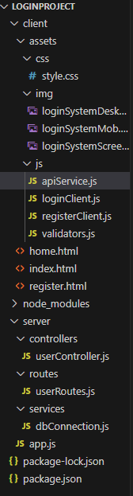
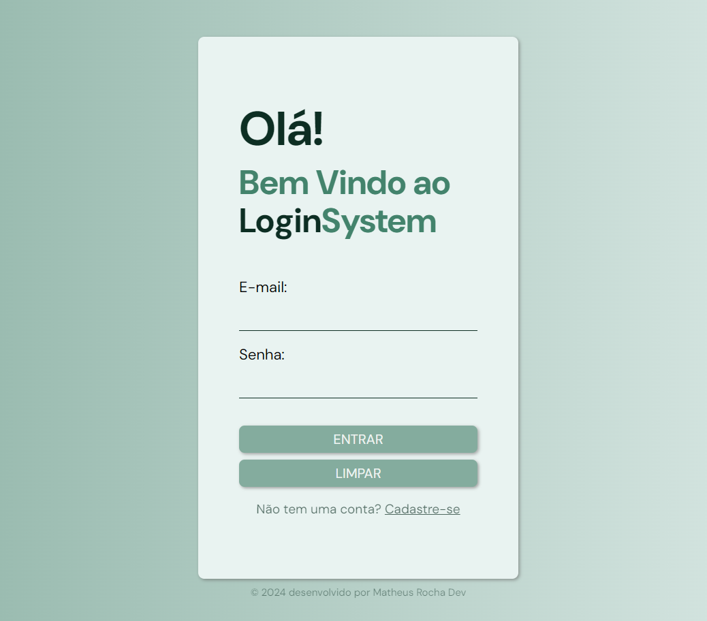
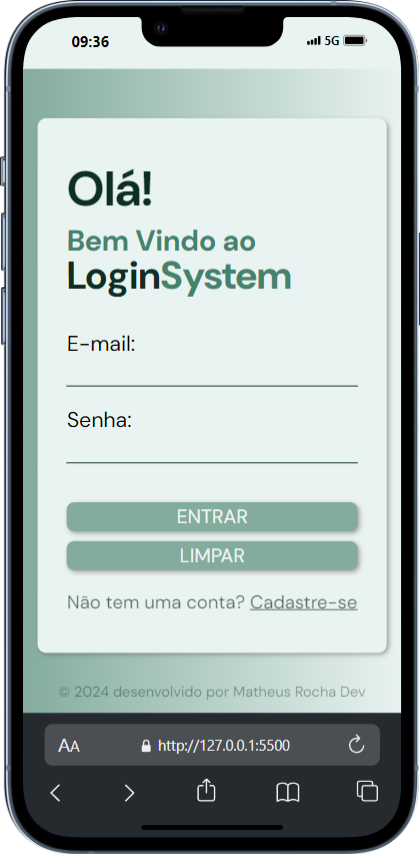
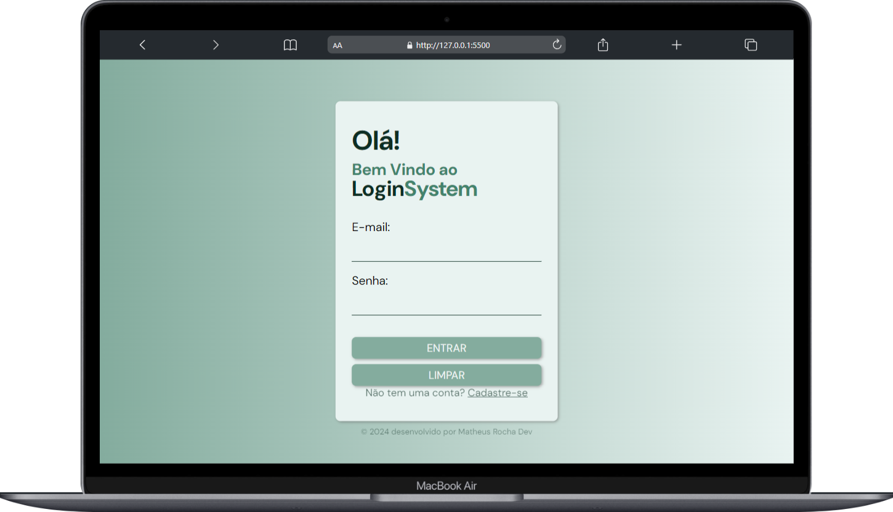

# Login System

## 📋 Descrição
Esse é o meu primeiro projeto full-stack!! 🎉 Criei um sistema de login e cadastro para praticar e demonstrar meu conhecimento em desenvolvimento web. 

O objetivo era construir uma aplicação completa, passando por todas as etapas: desde a criação da interface, backend e integração com banco de dados.

## 🚀 Funcionalidades
- **Cadastro de Usuário**: Permite que o usuário crie uma conta com nome, e-mail e senha.
- **Login de Usuário**: Faz a autenticação com e-mail e senha.
- **Redirecionamento**: Após login bem-sucedido, o usuário é direcionado para uma página "home".
- **Validação de Dados**: Implementação de validação básica no formulário de cadastro e login.

## 🛠️ Tecnologias Utilizadas
**Front-end:**
- HTML5
- CSS3
- JavaScript (ES6)

**Back-end:**
- Node.js
- Express.js

**Banco de Dados:**
- MySQL

## 📂 Estrutura do Projeto
A estrutura do projeto é organizada da seguinte forma:
- **Pastas**: 


## 🖼️ Imagens do Projeto
- **Tela**: 
- **Mobile**: 
- **Desktop**: 

## 🚀 Como Executar o Projeto

### Pré-requisitos
- Node.js
- MySQL

### Passos
1. Clone o repositório:
   - `git clone https://github.com/seu-usuario/login-system.git`
   
2. Instale as dependências:
   - Acesse o diretório do projeto e execute:
     - `npm install`
   
3. Configure o Banco de Dados:
   - Crie um banco de dados no MySQL e configure suas credenciais no arquivo `server/services/dbConnection.js`:
     ```javascript
     const dbConnection = mysql2.createConnection({
         host: 'localhost', // Substitua pelo seu host
         user: 'seu_usuario', // Substitua pelo seu usuário
         password: 'sua_senha', // Substitua pela sua senha
         database: 'login_project' // Nome do banco de dados
     });
     ```

4. Inicie o Servidor:
   - Execute o comando:
     - `node server/app.js`
   - O servidor estará disponível em `http://localhost:3001`.

5. Teste o Projeto:
   - Abra `index.html` no seu navegador e faça o cadastro/login para testar as funcionalidades.


## 🔧 Melhorias Futuras
Esse projeto ainda pode ser melhorado com as seguintes funcionalidades:
- Implementar autenticação com JWT.
- Adicionar mensagens de feedback para o usuário (erros/sucessos).
- Proteger as rotas do back-end.
- Criar um layout ainda mais responsivo e acessível.


